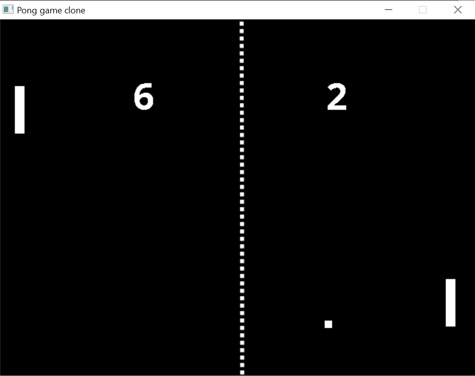

# Pong-Clone
A 2D pong game clone written in C++ with SDL2 libraries

</img>

## Current progress:
 - (V) Paddles / Ball movement
 - (V) Collision / Bounce
 - (V) Score display
 - ( ) Add level
 - ( ) Add Sound, Music
 - ( ) Add game state (Menu state, Play state)
 - ( ) Add AI opponent
 - ( ) Code refactoring

## Instructions
#### Before Use
To build this project, you will need to install SDL2 developer libraries:

[SDL2](https://www.libsdl.org/download-2.0.php) 
[SDL2_image](https://www.libsdl.org/projects/SDL_image/) 
[SDL2_ttf](https://www.libsdl.org/projects/SDL_ttf/) 
[SDL2_mixer](https://www.libsdl.org/projects/SDL_mixer/) 

## Game Control
#### Left paddle: 
- < W > Go Up
- < S > Go Down
#### Right paddle:
- < Up Arrow > Go Up
- < Down Arrow > Go Down

## Credits
 - Some of the code in this project is repurposed from [Lazy Foo's tutorials](http://lazyfoo.net/tutorials/SDL/index.php).
 - Score board font (OpenSans-Bold.ttf): 
 "OpenSans-Bold" by Ascender Fonts (http://www.ascenderfonts.com) 
 Licence: Apache License v2.00 (https://www.fontsquirrel.com/license/open-sans)
